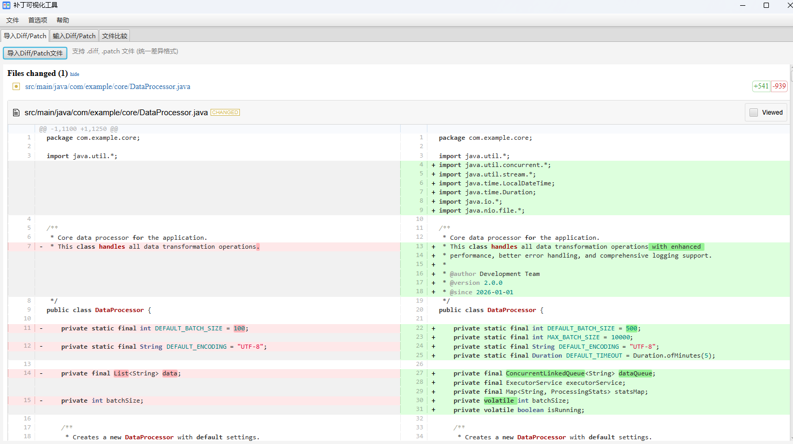

# Patch Visualizer

A JavaFX application for visualizing diff and patch files, supporting both Windows and Ubuntu environments.

## Features

- **Import Diff/Patch Files**: Import and visualize `.diff` or `.patch` files (unified diff format)
- **Input Diff/Patch Text**: Directly input or paste diff/patch text for visualization
- **Compare Files**: Select two files and view their differences side-by-side
- **Side-by-Side View**: Clear visualization of file differences with syntax highlighting
- **Cross-Platform**: Works on Windows and Ubuntu
- **Multi-language Support**: Available in English, Chinese, and Japanese

## Usage



### Import Diff/Patch Files (Default Tab)

1. Open the application
2. In the "Import Diff/Patch" tab (shown by default):
   - Click "Import Diff/Patch File" and select a `.diff` or `.patch` file
   - The unified diff will be visualized with syntax highlighting

### Input Diff/Patch Text

1. Open the application
2. Go to the "Input Diff/Patch" tab
3. Paste or type your diff/patch content in the text area
4. Click "Visualize" to display the diff with syntax highlighting

### Compare Files

1. Open the application
2. Go to the "Compare Files" tab:
   - Click "Browse..." to select the original file
   - Click "Browse..." to select the revised file
   - Click "Compare" to view the differences

## Requirements

- Java 21 or higher
- Maven 3.6 or higher

## Build

```bash
# Build the project
mvn clean package

# Run the application
mvn javafx:run
```

## Dependencies

- [JavaFX 21](https://openjfx.io/) - UI framework
- [java-diff-utils](https://github.com/java-diff-utils/java-diff-utils) - Diff generation library
- [PreferencesFX](https://github.com/dlemmermann/PreferencesFX) - Preferences management framework
- [diff2html](https://diff2html.xyz/) - HTML diff visualization (offline resources included)

## License

This project is licensed under the MIT License - see the [LICENSE](LICENSE) file for details.
